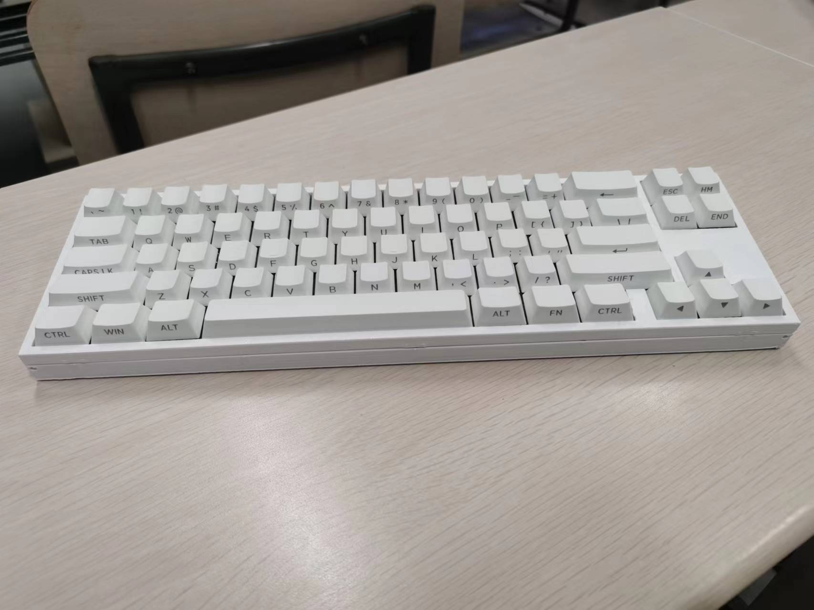
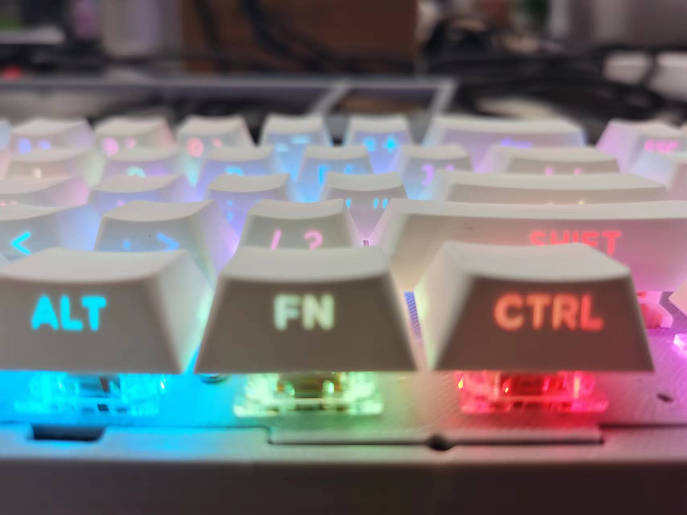
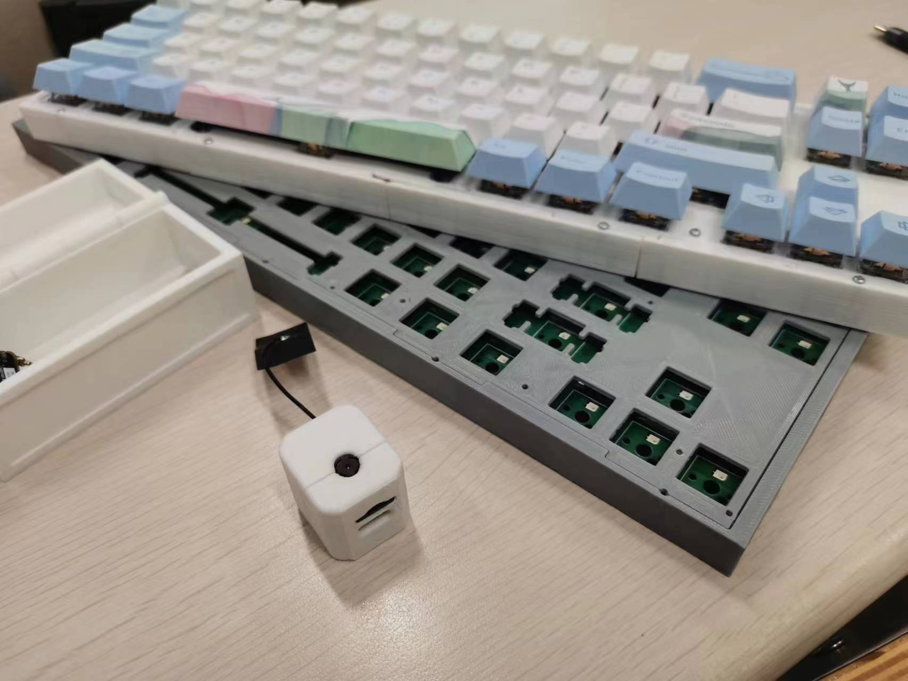
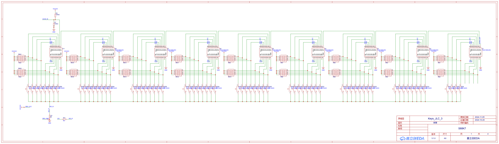
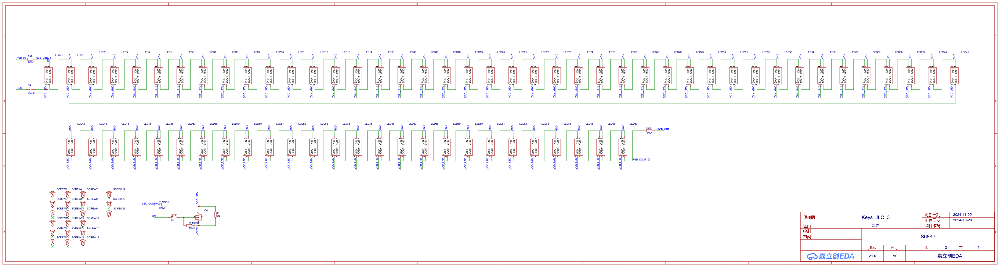
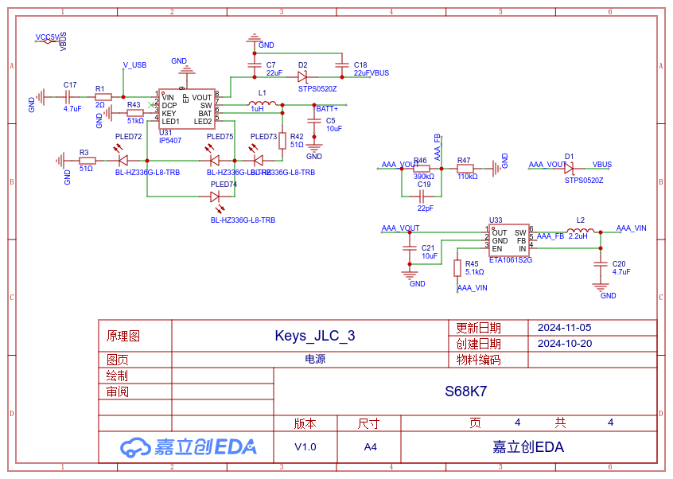
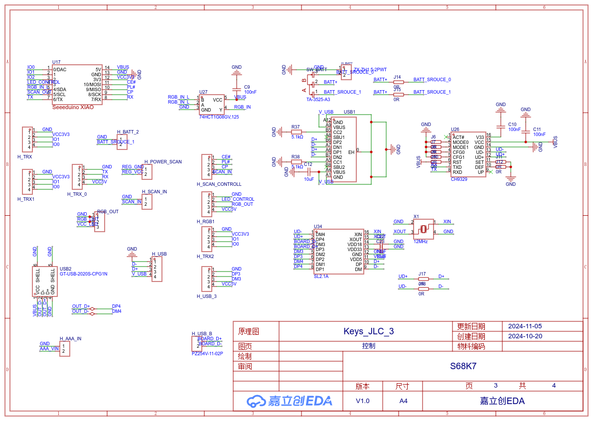

# pyKeyboardOS

A Real-Time OS built for Keyboard using CircuitPython.

## Software

### Files

- module/keyboard: Circuit Python Keyboard(usb & ble)

### Usage

#### Circuit Python Keyboard

- Fn + Q: connection via right usb type-c
- Fn + W: connection via upper usb type-c
- Fn + E: connection via bluetooth
- Fn + BackSpace: erase saved bluetooth info(use when connection error)
- Fn + TAB: switch rgb lighting mode
- Fn + UP_ARROW: light++
- Fn + DOWN_ARROW: light--

- Fn + Home: PageUp
- Fn + End: PageDown
- Fn + Esc: PrtSc
- Fn + 1-10,-+: F1-12

### Changes

#### 2024.11.05
- [Unlocking the Key to CircuitPython: Crafting Custom Keystrokes for a DIY Keyboard](https://docs.qq.com/slide/DUkpNVmtPandxWmdu)

#### 2024.11.01
- Fix Bluetooth(hardward issue)
- Add Basic RGB colors
- 6-key sequential(via upper usb type-c)

#### 2024.10.21
- Update PCB adaptation
- Disable BLE

#### 2024.10.08
- [Middle Term Report](https://docs.qq.com/slide/DUnJsUXBYbUl4WGhJ)
- Final Goal: Basic Keyboard + Sleep Mode + At Least One Modular Module (Camera, Screen, Numpad, etc.).

##### Basic Keyboard
- Connection via USB or BLE.
- Basic RGB lighting
- Basic key mapping

##### Sleep Mode
- Auto-sleep (low power mode)
- Low-latency waking

##### Modular Modules
- Camera
- Screen
- Numpad
- Knobs
- Motor

#### 2024.10.05
- Add independent camera code

#### 2024.09.27

- Set the CH9329 as the default connection.
- When using the CH9329 connection, if more than six keys are pressed simultaneously, the additional (beyond six) keys will be released in the order they were pressed.

### Tracking

- wpa2 enterprise support: https://github.com/zephyrproject-rtos/zephyr/pull/78921

## Hardware

### Prototype Keyboard Case Design

- Foot Pads: Completed √
- Li Battery: Completed √
- Upper-side USB port: Completed √
- USB HUB: Testing
- Dry Battery: Designing

### S68K7 2024.10.28 (Under construction)

#### Schematic Diagram (Non-final version, proceed with caution.)

#### PCB (Non-final version, proceed with caution.)
[S68K7](PCB/S68K7/PCB_PCB108_1_2024-11-05.pdf)

### S68K6 2024.10.13 (success; Prototype 2)

- Use IP5407 power circuit(works fine).
- Add USB Type A for external power supply. 

### S68K5 2024.9.30 (failed; power)

- Use SX1308 power circuit(significant error)
- Place the battery interface on the top
- Thickness of the main control board
- Front height, foot support
- Check key position coordinates

### S68K4 2024.8.26 (partial success; Prototype 1)

- Use ETA9741 power circuit
- Replace single-channel AND gate circuit
- Automatic charge-discharge switching
- Battery switch MOS control
- Physical battery switch position
- MCU main control board
- Key alignment
- PCB shape

### S68K3 2024.8.19 (failed; power)

- RGB input signal interruption (replace 470K resistor with 500Ω and add 3.3v-5v boost circuit) √
- Battery charging anomaly (seems fine, recheck; prone to failure?)
- Charging circuit capacitor optimization
- Charging indicator light arrangement optimization √
- Replace charging interface with a surface mount √
- Reduce component variety
- USB to TTL chip √
- USB Type-C pin GND reversed (Done, to be checked) √
- Consider moving USB Type-C upwards

### S68K2 2024.7.31 (failed; power, led)

- RGB LED pin assignment error (replaced backing in the next design)
- Power supply short circuit (replaced battery chip in the next design)

## TODO:
- Add Prototype Picture
- Migrate to MicroPython

## Reference

- circuitpython-ch9329: https://github.com/74th/circuitpython-ch9329
- HelloWord-Keyboard: https://github.com/peng-zhihui/HelloWord-Keyboard
- nRF52840-2.4GKeyboard: https://github.com/BrianLChen/nRF52840-2.4GKeyboard

