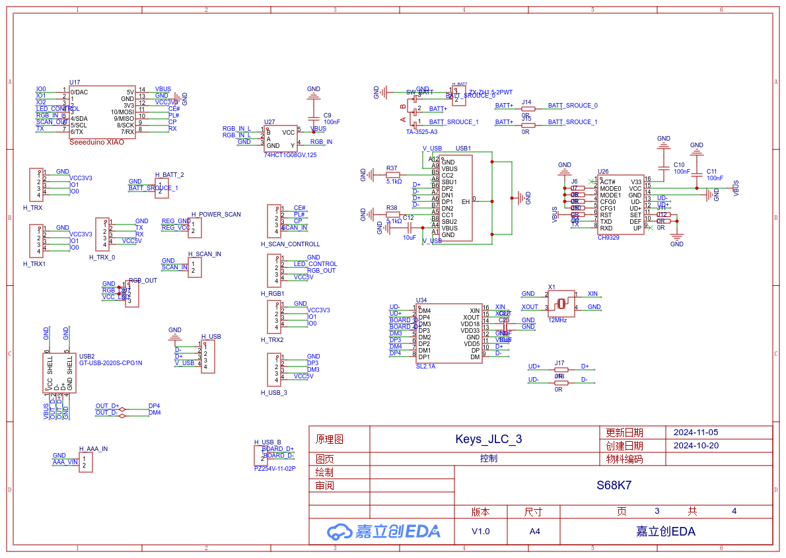

# Unlocking the Key to CircuitPython - Crafting Custom Keystrokes for a DIY Keyboard

[Unlocking the Key to CircuitPython: Crafting Custom Keystrokes for a DIY Keyboard](https://docs.qq.com/slide/DUkpNVmtPandxWmdu)

### 宋曦轩 2021010728 操作系统专题训练结课报告

## 键盘硬件

### 外壳
1. 5°人体工程倾角
2. Gasket结构


### 原理图
1. USB HUB
2. 充电宝功能
3. RGB灯珠
4. IIC拓展接口
5. 移位寄存器级联




### PCB
1. 热插拔轴座
2. 螺丝孔
[S68K7](../PCB/S68K7/PCB_PCB108_1_2024-11-05.pdf)

## CircuitPython For Keyboard

### 上电启动
circuitpython在启动后，会依次执行：
1. 初始化硬件，包括GPIO，串口，IIC，SPI等接口
2. 运行boot.py，运行由python撰写的初始化代码
3. 检测是否有通过usb连接主机设备，如果有，运行repl.py
4. 运行用户代码code.py

### 物理按键
根据移位寄存器原理，每次扫描 $9$ 个移位寄存器之后，可以获得一个 $9*8=72$ 位的bitmap，其中被按下键位的值为 $0$，未被按下按键的值为 $1$。
根据硬件设计建立物理按键与index的编号：
```python
physical_key_name_map = {
    "A": 45,
    "B": 30,
    "C": 38,
    "D": 37,
    "E": 36,
    ...
}
```
记录在`config/physical_key_name_map.json`文件中。

由于物理按键不仅对应按键开关，还对应了键位上的RGB灯珠，因此建立一个物理按键类`PhysicalKey`，用于维护开关`self.pressed: bool`和颜色`self.color: tuple(int, int, int)`信息。
```python
class PhysicalKey:
    def __init__(self, key_id: int, key_name: str, max_light_level: int = max_light_level) -> None:
        self.physical_id = key_id
        self.key_name = key_name
        self.pressed = False
        self.color = (max_light_level, max_light_level, max_light_level)
        self.random_color(max_light_level)
    
    def random_color(self, max_light_level):
        self.color = (
            random.randint(0, max_light_level),
            random.randint(0, max_light_level),
            random.randint(0, max_light_level)
        )
```

### 键位映射
对于不同工作需求，键盘需要改变其按键功能布局。为了便于改键，定义物理按键到虚拟按键的映射。物理按键用于记录开关状态，虚拟按键则包含了按键按下时发送的信号`keycode`或者执行的函数`pressed_function`。
```python
class VirtualKey:
    def __init__(self, key_name: str, keycode: int, bind_physical_key: PhysicalKey, pressed_function=None) -> None:
        self.keycode = keycode
        self.key_name = key_name
        self.pressed_function = pressed_function
        self.bind_physical_key = bind_physical_key
        self.pressed = False
        self.update_time = time.time()

    def is_pressed(self):
        pressed = self.bind_physical_key.pressed
        return pressed

    def press(self):
        self.pressed = True
        if self.pressed_function:
            pressed_function_result = self.pressed_function()
            if pressed_function_result is None:  # TODO
                return None
            return pressed_function_result
        return None
        
    def release(self):
        self.pressed = False
        return None
```
`VirtualKey.bind_physical_key`为虚拟按键绑定的物理按键。当物理按键处于按压状态时，扫描函数会调用`VirtualKey.press`。如果虚拟按键有绑定函数，则执行绑定函数`VirtualKey.pressed_function`，该函数可用于改变键盘转态（例如连接模式，灯光亮度）。根据`VirtualKey.pressed_function`的返回值，决定是否发送键盘原本的键值。如果未绑定函数，则发送键盘原本的键值`keycode`。

为了便于修改键位绑定，设置`config/mapping.json`和`config/fn_mapping.json`两个键位映射，分别用于修改默认层键位映射和`Fn`层（按住`Fn`）键位映射。

`config/mapping.json`
```json
{
    "PAGE_UP": "HOME",
    "PAGE_DOWN": "END",
    "ESCAPE": "GRAVE_ACCENT",
    "INSERT": "ESCAPE"
}
```

`config/fn_mapping.json`
```json
{
    "ONE": "F1",
    "TWO": "F2",
    "THREE": "F3",
    ...
}
```

这里给出一个将按键绑定键盘控制函数的例子：将灯光亮度控制函数`change_light_level`和`change_light_mode`绑定到按键上。
```python
virtual_key_layers[fn_key_layer_id][physical_key_map["UP_ARROW"].physical_id].pressed_function = partial(change_light_level, 32)
virtual_key_layers[fn_key_layer_id][physical_key_map["DOWN_ARROW"].physical_id].pressed_function = partial(change_light_level, -32)
virtual_key_layers[fn_key_layer_id][physical_key_map["TAB"].physical_id].pressed_function = change_light_mode
```

### 信号发送
由于键盘有多种连接方式连接到主机（USB1, USB2, BLE），因此建立一个键盘类`VirtualKeyBoard`，统一三种连接方式。
```python
class VirtualKeyBoard:
    def __init__(self, mode=on_start_keyboard_mode, usb_timeout=1):
        self.mode = mode
        
        self.adapter = _bleio.adapter
        if not self.adapter.enabled:
            self.adapter.enabled = True

        self.mac_address = self.adapter.address
        print("Bluetooth MAC Address:", self.mac_address)
        self.ble = BLERadio()
        self.ble_hid = HIDService()
        self.advertisement = ProvideServicesAdvertisement(self.ble_hid)
        self.advertisement.appearance = 961
        self.advertisement.short_name = "s68k"
        self.advertisement.complete_name = "s68k esp32s3 keyboard"
        self.ble_keyboard = Keyboard(self.ble_hid.devices)

        try:
            self.usb_hid_keyboard = Keyboard(usb_hid.devices, timeout=usb_timeout)
        except:
            self.usb_hid_keyboard = None

        self.ch9329_keyboard = CH9329(uart)
    
        self.set_mode(self.mode)
        self.reset()

    def erase_bonding(self):
        self.adapter.erase_bonding()

    def set_mode(self, mode, usb_timeout=1):
        if mode == "bluetooth" and self.mode != "bluetooth":
            if not self.ble.advertising:
                self.ble.start_advertising(self.advertisement)
        elif self.mode == "bluetooth" and mode != "bluetooth":
            if self.ble.advertising:
                self.ble.stop_advertising()

        self.mode = mode

        if mode == "usb_hid" and self.usb_hid_keyboard is None:
            try:
                self.usb_hid_keyboard = Keyboard(usb_hid.devices, timeout=usb_timeout)
            except:
                self.usb_hid_keyboard = None
                self.mode = "dummy"
    
    def reset(self):
        if self.usb_hid_keyboard is not None:
            self.usb_hid_keyboard.release_all()
        if self.ch9329_keyboard is not None:
            self.ch9329_keyboard.keyboard_release_all()
        if self.ble_keyboard is not None:
            self.ble_keyboard.release_all()

    def press(self, *keycodes: int) -> None:
        if self.mode == "usb_hid":
            if self.usb_hid_keyboard is not None:
                try:
                    self.usb_hid_keyboard.press(*keycodes)
                except:
                    self.set_mode("dummy")
            else:
                raise ValueError(f"self.usb_hid_keyboard is None")
        elif self.mode == "ch9329":
            if self.ch9329_keyboard is not None:
                self.ch9329_keyboard.keyboard_press(*keycodes[:6])
            else:
                print(f"self.ch9329_keyboard is None")
        elif self.mode == "bluetooth":
            if self.ble_keyboard is not None:
                self.ble_keyboard.press(*keycodes)
            else:
                raise ValueError(f"self.ble_keyboard is None")
        elif self.mode == "dummy":
            pass
        else:
            raise NotImplementedError(f"self.mode: {self.mode}")

    def release(self, *keycodes: int) -> None:
        if self.mode == "usb_hid":
            if self.usb_hid_keyboard is not None:
                try:
                    self.usb_hid_keyboard.release(*keycodes)
                except:
                    self.set_mode("dummy")
            else:
                print(f"self.usb_hid_keyboard is None")
        elif self.mode == "ch9329":
            if self.ch9329_keyboard is not None:
                self.ch9329_keyboard.keyboard_release(*keycodes)
            else:
                raise ValueError(f"self.ch9329_keyboard is None")
        elif self.mode == "bluetooth":
            if self.ble_keyboard is not None:
                self.ble_keyboard.release(*keycodes)
            else:
                raise ValueError(f"self.ble_keyboard is None")
        elif self.mode == "dummy":
            pass
        else:
            raise NotImplementedError(f"self.mode: {self.mode}")
```

将切换连接模式的函数`VirtualKeyBoard.set_mode`绑定到特定虚拟按键上：
```python
virtual_key_layers[fn_key_layer_id][physical_key_map["Q"].physical_id].pressed_function = partial(kbd.set_mode, "usb_hid")
virtual_key_layers[fn_key_layer_id][physical_key_map["W"].physical_id].pressed_function = partial(kbd.set_mode, "ch9329")
virtual_key_layers[fn_key_layer_id][physical_key_map["E"].physical_id].pressed_function = partial(kbd.set_mode, "bluetooth")
virtual_key_layers[fn_key_layer_id][physical_key_map["R"].physical_id].pressed_function = partial(kbd.set_mode, "dummy")
```
对于蓝牙连接，需要`VirtualKeyBoard.erase_bonding`函数用于删除过期蓝牙信息：
```python
virtual_key_layers[fn_key_layer_id][physical_key_map["BACKSPACE"].physical_id].pressed_function = kbd.erase_bonding
```

尽管硬件支持全键无冲，但对于标准hid协议，同时只能向主机发送6个按下的按键。因此需要构建一个FIFO队列`CH9329._pressed_keys`，记录最后处在按下状态的6个按键：
```python
class CH9329:
    def __init__(self, uart: UART, address: int = 0x00):
        self._pressed_keys: list[int] = list()
        self._pressed_modifier_keys: list[int] = list()
        ...
```

### 按键扫描以及灯光控制
由于circuitpython不支持多线程，因此需要通过批处理在主循环中循环执行扫描、发送和灯光控制。
```python
# scan loop
while running:
    register_bits = read_shift_registers()
    pressed_key_ids = get_pressed_key_ids(register_bits)
    # physical scan
    for key in physical_keys:
        if key.physical_id in pressed_key_ids:
            if key.pressed == False:
                key.random_color(max_light_level)
                pass
            key.pressed = True
        elif key.pressed == True:
            key.pressed = False

    # virtual key and send
    virtual_key_layer_id = int(fn_key.pressed)
    for key in virtual_key_layers[virtual_key_layer_id].values():
        if key.is_pressed():
            if key.pressed == False:
                key.press()
                if key.pressed_function is None:
                    kbd.press(key.keycode)  # 可能出现阻塞
            key.update_time = time.time()
        else:
            if key.pressed == True:
                key.release()
                kbd.release(key.keycode)
            key.update_time = time.time()

    # light control
    light_key_ids = physical_key_ids if light_mode == "random_static" else pressed_key_ids
    colors = [physical_key_id_map[pressed_key_id].color for pressed_key_id in light_key_ids]
    light_keys(light_key_ids, colors=colors, refresh=True)

    # sleep
    time.sleep(scan_interval)
```

在循环中，在按键信号发送阶段，可能存在阻塞的现象。例如在使用串口转USB连接模式，由于串口波特率低($9600$)，在按键数量较多时，数据发送可能导致延迟增加。

### 多线程

circuitpython在esp32-s3上的运行时依托FreeRTOS。因此可以通过xTaskCreate运行两个circuitpython解释器，运行两个circuitpython线程，执行不同代码。但是由于不存在互斥锁，因此直接创建新circuitpython解释器，会引起硬件资源冲突。
`main.c`
```c
if (pyexec_mode_kind == PYEXEC_MODE_FRIENDLY_REPL) {
    // If code.py did a fake deep sleep, pretend that we
    // are running code.py for the first time after a hard
    // reset. This will preserve any alarm information.
    // skip_repl = run_code_py(get_safe_mode(), &simulate_reset);
    // 创建任务1
    run_code_py_running = true;
    serial_write("Preparing task_run_code_py. ");
    xTaskCreate(&task_run_code_py, "task_run_code_py", 4096, NULL, 5, NULL);
    serial_write("Running task_run_code_py. ");
    ulTaskNotifyTake(pdTRUE, portMAX_DELAY);
    serial_write("Finish task_run_code_py, blocking by run_code_py_running. ");
    // while(run_code_py_running)
        vTaskDelay(pdMS_TO_TICKS(1000));
    serial_write("Finish run_code_py_running. ");
} else {
    skip_repl = false;
}
```

相比于circuitpython，mircopython实现了`_thread`与互斥锁。后续工作中，计划将键盘代码迁移到mircopython。

## 总结
在本课程中，我们成功设计并实现了一款支持热插拔的机械键盘，涵盖了外壳设计、原理图、PCB布局以及基于CircuitPython的功能实现。该键盘具备USB HUB、充电宝功能、RGB灯珠和IIC扩展接口等硬件特性。在软件方面，我们使用CircuitPython进行开发，实现了物理按键扫描、键位映射和信号发送等功能。通过定义物理按键和虚拟按键类，我们实现了按键功能的灵活配置，并通过绑定函数实现了键盘的高级控制功能。此外，课程还探讨了多线程实现的可能性，并计划将代码迁移到MicroPython，以利用其多线程支持。
